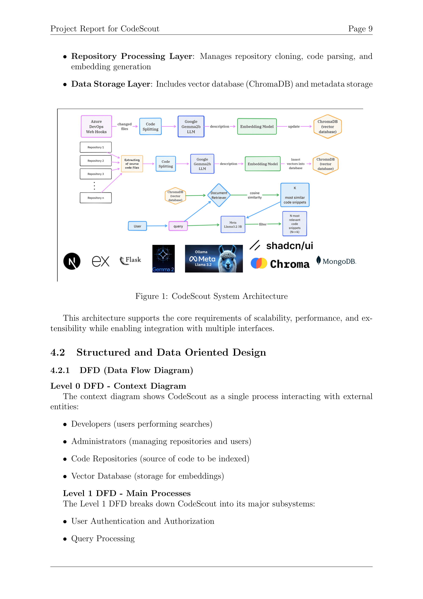
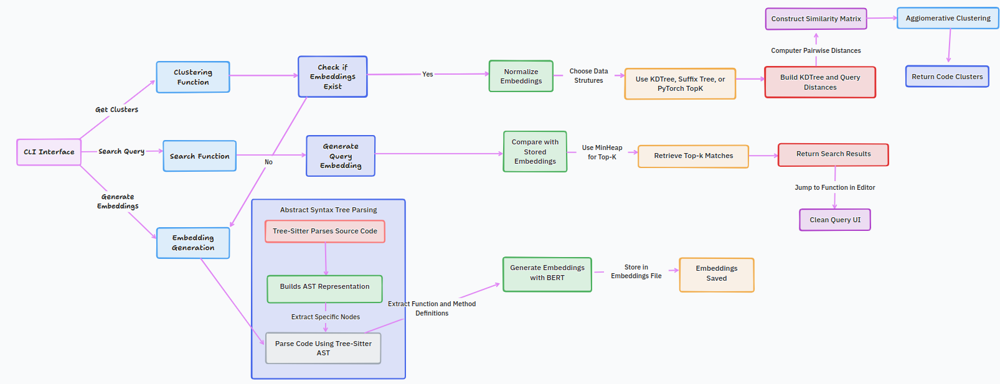

# CodeScout: Natural Language Code Search in Organization

## Overview

CodeScout is a semantic code search tool that allows developers to find relevant code snippets using natural language queries. Unlike traditional keyword-based search tools, CodeScout leverages Natural Language Processing (NLP) and vector embeddings to understand the semantic meaning behind code, enabling more intuitive and effective code discovery.

## Demo Videos
[WEB Interface](https://youtu.be/5Sw2deO0EsE)

[CLI](https://youtu.be/eYwJ-wFe3eg)

## Architecture Diagram




## Problem Statement

Software development teams frequently spend significant time searching for relevant code snippets, understanding implementation patterns, or finding examples of functionality across large codebases. Traditional keyword-based search tools are limited in their ability to understand the semantic meaning behind code, resulting in inefficient searches that fail to capture the developer's intent.

## Key Features

- **Natural Language Search**: Find code by describing functionality rather than remembering exact keywords
- **Multiple Interfaces**: Web application, CLI tool, and VS Code extension
- **Multi-Language Support**: Search across different programming languages
- **Semantic Understanding**: Powered by Google Gemma2b LLM for code semantics
- **Code Comparison**: Compare different implementations side-by-side
- **Team Management**: Organize repositories and manage access permissions
- **Repository Integration**: Add repositories from Git URLs or local paths

## Architecture

CodeScout implements a multi-tier architecture with the following components:

- **Frontend Layer**: Web interface, VS Code extension, and CLI tool
- **API Layer**: REST API for communication between frontend and backend services
- **Search Engine Layer**: Handles query processing, embedding generation, and vector search
- **Repository Processing Layer**: Manages repository cloning, code parsing, and embedding generation
- **Data Storage Layer**: Includes vector database (ChromaDB) and metadata storage

## Installation and Setup

### Prerequisites

- Python 3.9+
- Node.js 16+
- Docker (optional, for containerized deployment)

### Backend Setup

```bash
# Clone the repository
git clone https://github.com/your-org/codescout.git
cd codescout/flask_backend

# Install dependencies
pip install -r requirements.txt

# Start the backend server
python app.py
```

### Frontend Setup

```bash
# Navigate to frontend directory
cd ../frontend

# Install dependencies
npm install

# Start development server
npm run dev
```

### CLI Tool Installation

```bash
# Navigate to cli tool directory
cd ../cli\ tool

# Install the CLI tool
pip install -e .

# Run the CLI tool
codescout --help
```

## Usage

### Web Interface

1. Navigate to `http://localhost:3000` in your browser
2. Log in with your credentials
3. Enter a natural language query in the search bar
4. Browse through the search results
5. Click on any code snippet to view more details

### CLI Tool

```bash
# Search for code
sem "function to authenticate user with JWT"

# Add a repository
sem --embed path-to-your-repo

# Clustering similar codes 
sem --cluster --cluster-max-distance .2
```

## Technology Stack

- **Backend**: Python, Flask, ChromaDB
- **Frontend**: Next.js, React
- **Embedding Model**: Google Gemma2b LLM
- **Vector Database**: ChromaDB
- **CLI**: Python with Click
- **Repository Processing**: Git, AST parsing libraries

## Project Structure

```
.
├── cli tool                 # Command-line interface tool
├── diagrams                 # System architecture diagrams
├── flask_backend           # Flask backend API
│   ├── app.py              # Main application entry point
│   ├── services            # Core services
│   └── utils               # Utility functions
├── frontend                # Next.js frontend application
│   ├── src                 # Source code
│   │   ├── app             # Pages and routes
│   │   ├── components      # React components
│   │   └── lib             # Utility functions
└── README.md               # This file
```

## Contributing

We welcome contributions to CodeScout! Please see our [Contributing Guide](CONTRIBUTING.md) for details on how to get started.

## License

This project is licensed under the MIT License - see the [LICENSE](LICENSE) file for details.
