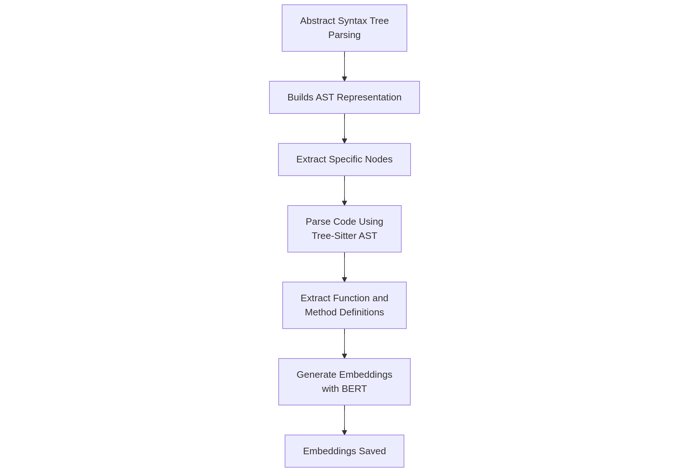
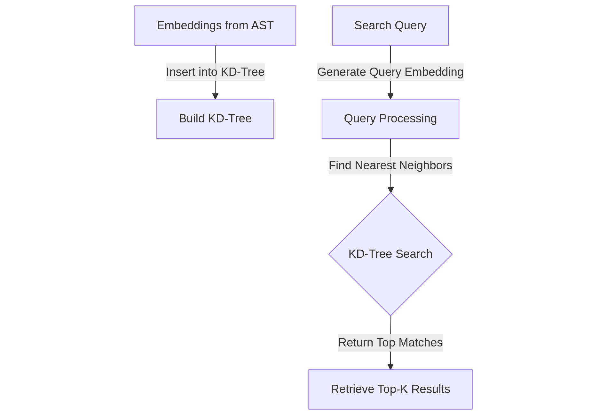
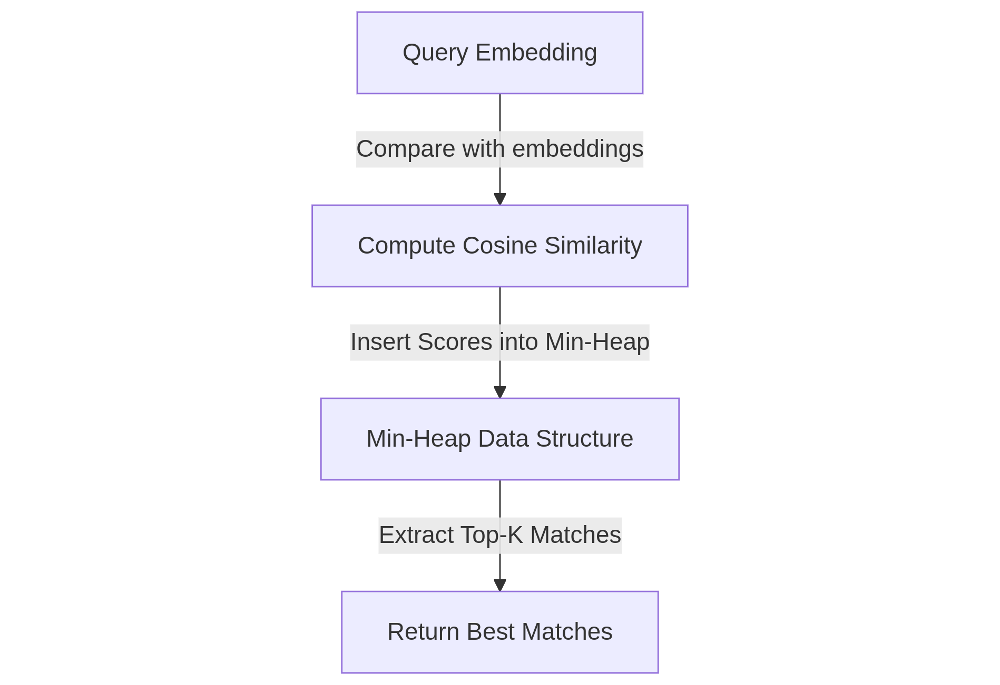
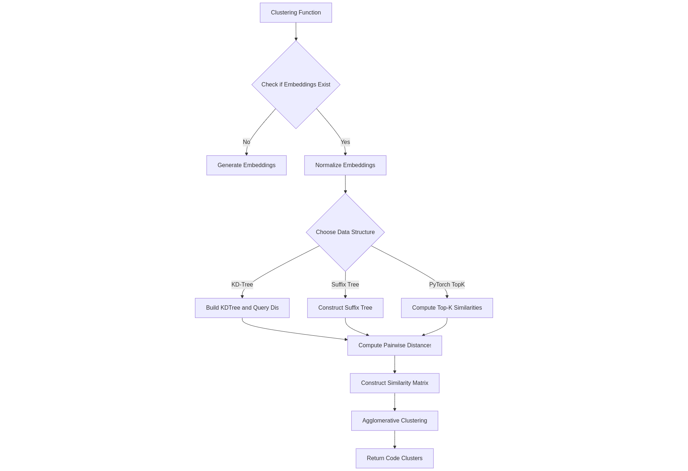
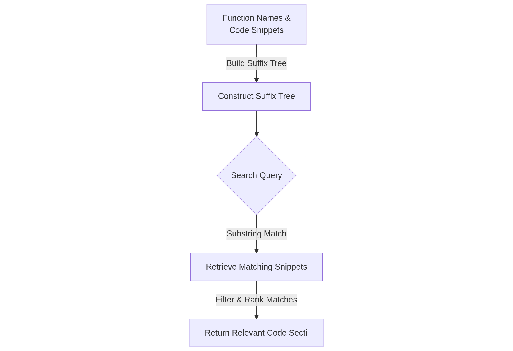
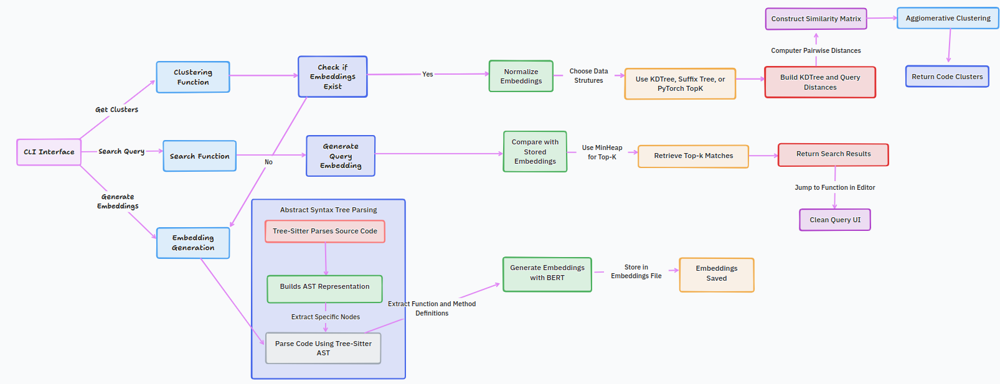

# Semantic Search in Codebase

## Abstract
Codebases tend to grow significantly over time, making it increasingly difficult for developers to locate relevant functions and methods. This project introduces a command-line tool that enables developers to search their codebase using semantic queries. By leveraging embeddings generated from `sentence-msmarco-bert-base-dot-v5-nlpl-code_search_net` and data structures like KD-Trees and min-heaps, the tool efficiently retrieves relevant functions based on semantic similarity. Additionally, the tool supports clustering of similar code snippets, providing further insights into the structure of the codebase.

## Problem Statement
Developers often struggle to find specific code snippets within large repositories. Traditional keyword-based searches are limited in their ability to capture the semantic meaning of functions. This project aims to bridge that gap by implementing a semantic search mechanism that enables intuitive and efficient code retrieval.

## Aim
To develop a CLI-based tool that allows developers to perform semantic searches on their codebase, retrieve relevant functions efficiently, and cluster similar code snippets for better organization and analysis.

## Project Objectives
1. **Implement a CLI-based search tool** that allows developers to find functions and methods using semantic queries.
2. **Generate embeddings** for code snippets using `sentence-msmarco-bert-base-dot-v5-nlpl-code_search_net`.
3. **Extract relevant nodes** from the codebase using an **Abstract Syntax Tree (AST)** via Tree-sitter.
4. **Utilize efficient data structures** such as KD-Trees and min-heaps for fast retrieval and clustering.
5. **Provide clustering functionality** to identify and group similar code snippets.
6. **Enable seamless integration with code editors** for quick access to retrieved functions.

## Illustrate Suitable Data Structures

### 1. **Abstract Syntax Tree (AST) – Tree-sitter**
   - **Purpose**: Extract meaningful components of the codebase (e.g., function definitions, class declarations).
   - **Implementation**:
     - The CLI takes the input source code.
     - It is parsed using **Tree-sitter**, which generates an **AST representation**.
     - The AST allows us to extract **only** relevant nodes (functions and methods), ensuring that unnecessary parts (e.g., comments, imports) do not affect the search process.
   - **Benefit**: Helps in structuring and preprocessing the code before generating embeddings.

   

---

### 2. **Embeddings – KD-Tree**
   - **Purpose**: Efficiently store and search for semantically similar embeddings.
   - **Implementation**:
     - Each extracted function from the AST is **converted into an embedding** using **BERT-based models**.
     - The embeddings are stored in a **KD-Tree**.
     - When a user queries a function, its **query embedding** is generated and compared against the stored KD-Tree to find the nearest neighbors.
   - **Why KD-Tree?**
     - KD-Trees are optimized for searching in high-dimensional space.
     - They provide logarithmic time complexity (`O(log N)`) for nearest neighbor search, significantly improving performance over brute-force comparisons.
   
   **Time Complexity Breakdown:**
   - **Embedding Normalization:** `O(n * d)`
   - **K-D Tree Construction:** `O(n * log(n) * d)`
   - **K-Nearest Neighbor Query:** `O(n * log(n) * d)`
   - **Each query takes `O(log(n))`, performing for `n` points.**

   **Total Time Complexity:** `O(n * log(n) * d)`
   
   

---

### 3. **Min-Heap – Top-K Retrieval**
   - **Purpose**: Retrieve the **top K** most relevant results from the KD-Tree search.
   - **Implementation**:
     - After the KD-Tree finds **approximate nearest neighbors**, the min-heap is used to **store the Top-K results**.
     - The similarity scores (e.g., **cosine similarity**) determine which functions are most relevant.
   - **Why Min-Heap?**
     - A **min-heap** efficiently maintains the **top-K** elements in `O(log K)` time.
     - Ensures that only the best-matching functions are returned.
   
   

---

### 4. **Clustering – KD-Tree + Suffix Tree + Agglomerative Clustering**
   - **Purpose**: Group semantically similar functions together.
   - **Implementation**:
     - The tool checks if embeddings **already exist** in storage.
     - The embeddings are **normalized** for distance-based clustering.
     - Different data structures are used based on the use case:
       - **KD-Tree**: Used for quick nearest neighbor searches.
       - **Suffix Tree** (Super slow, not recommended for large datasets): Helps analyze code similarity based on function names or patterns.
       - **PyTorch TopK**: An alternative for efficiently finding closest embeddings.
     - After distance computation, **Agglomerative Clustering** is applied to form meaningful groups.
   
   **Comparative Analysis:**
   - **Normal Approach:** `O(n³ + n*d)`
   - **Improved Approach:** `O(n * log(n) * d)`
   - **Improvement:** Reduced clustering complexity from `O(n³)` to `O(n²)`, significantly enhancing performance.
   
   

---

### **Suffix Tree – (Super Slow & Inefficient for Large Codebases)**
   - **Purpose**: Identify similar function names and patterns.
   - **Implementation**:
     - Uses **longest common substring** techniques for similarity computation.
     - Runs nested loops for function comparisons, making it highly inefficient.
   
   **Time Complexity Breakdown:**
   - **Embedding Normalization:** `O(n)`, where `n` is the number of functions.
   - **Outer Loop (Iterate through functions):** `O(m)`, where `m` is the total number of functions.
   - **Inner Comparison Loop:** `O(m²)`, as each function is compared to all others.
   - **Longest Common Substring Calculation:** `O(l²)`, where `l` is the average function text length.

   **Total Time Complexity:** `O(m² * l²)`, making it infeasible for large datasets.
   
   **Space Complexity:** `O(m * l)`, inefficient for large repositories.

   **Key Drawbacks:**
   - **Super slow for large datasets (> 10,000 points).**
   - **Memory-intensive and computationally expensive.**
   - **KD-Trees are a much better alternative.**
   
   

---

## Applications

### **1. Command-Line Interface (CLI)**
- The tool provides a **lightweight** and **efficient** interface for developers to search their codebase without opening an IDE.
- Developers can **quickly retrieve functions** related to a given query, saving time compared to manually searching through files.
- Supports **fuzzy matching** and **approximate nearest neighbor retrieval** to handle cases where exact matches are unavailable.
- Enables **batch processing** for analyzing large codebases and generating semantic clusters.

### **2. Code Clustering**
- Helps in **identifying duplicate or highly similar functions** across the repository, aiding in code optimization and maintenance.
- Clustering results can be used to **detect redundant implementations** and refactor them into reusable components.
- Enables **automated refactoring suggestions**, reducing technical debt in large-scale projects.
- Facilitates **code review and knowledge sharing** by grouping related functions across different modules.

### **3. Quick Navigation**
- Integrates with **code editors (VS Code, Vim, Emacs, etc.)**, allowing users to **jump to relevant functions** instantly.
- Provides a **fast lookup feature** for developers who frequently switch between different parts of a codebase.
- Can be extended with **keyboard shortcuts or terminal aliases** for even faster access.
- Supports **multi-file searching**, enabling users to find functions spread across multiple directories.

### **4. Enhanced Code Maintenance**
- **Semantic search** improves **code readability and maintainability** by providing more intuitive function lookups.
- Helps in **onboarding new developers** by allowing them to find related implementations and understand project structure.
- Enables **automated documentation generation** by identifying function clusters and suggesting meaningful descriptions.
- Supports **legacy code analysis**, helping teams to refactor and modernize outdated codebases.
- Reduces **developer fatigue** by streamlining searches, preventing unnecessary rewrites of existing functions.

## Flowchart

## References
1. [Tree-sitter](https://tree-sitter.github.io/)
2. [Semantic Search using Sentence-BERT](https://www.sbert.net/docs/quickstart.html)
3. [Scipy KDTree Documentation](https://docs.scipy.org/doc/scipy/reference/generated/scipy.spatial.KDTree.html)

